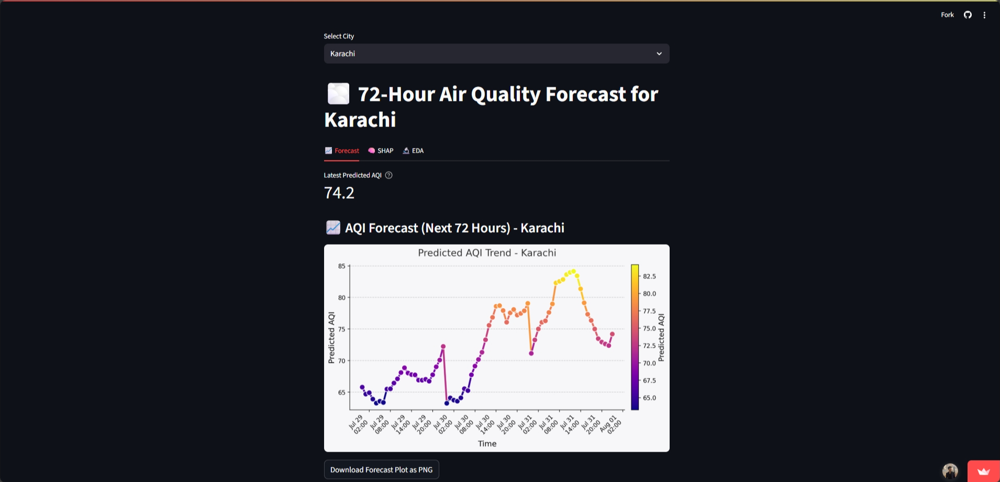

# 🌫️ AQI Multi-City Forecasting & Analysis Dashboard

An interactive and automated platform for **72-hour Air Quality Index (AQI) forecasting**, **model explainability**, and **exploratory data analysis (EDA)** for major cities in Pakistan — **Karachi, Islamabad, and Lahore**. The system is powered by CI/CD workflows, machine learning models, and a visually intuitive **Streamlit UI**.

---

## 🚀 Features

* 🔄 **Multi-City Forecasting:** Real-time AQI prediction for Karachi, Islamabad, and Lahore.
* ⚙️ **Automated Data Pipeline:**

  * Hourly/daily data fetched via **Open-Meteo APIs**.
  * Automatic deduplication and time-based merge for air quality and weather features.
  * Integrated with **GitHub Actions** for continuous updates.
* 📈 **Modeling:**

  * Trained multiple ML models: **Ridge Regression** (best-performing), Random Forest, Gradient Boosting, Linear Regression.
  * Auto-saves predictions and inputs for transparency and future analysis.
* 🧠 **Model Explainability:**

  * SHAP visualizations for feature impact per city.
  * Downloadable summary plots.
* 💻 **Interactive Streamlit Dashboard:**

  * Tabbed interface: **Forecast**, **SHAP**, and **EDA**.
  * Modern visualizations with **Plotly**, **Seaborn**, and **Matplotlib**.
  * Enhanced AQI table with emoji-based air quality bands.
  * Download buttons for all visual content.
* 📊 **Exploratory Data Analysis (EDA):**

  * Correlation heatmaps, histograms, time-series trends.
  * User-selectable feature views.

---

## 🗂️ Project Structure

```
.
├── app.py                        # Streamlit app UI
├── backfill_data.py             # Fetches and merges historical data
├── predict.py                   # Forecasting script + SHAP visualization
├── model.py                     # ML training and evaluation
├── requirements.txt             # Python dependencies
├── data/
│   ├── predicted_aqi_72hr.csv   # Latest predictions
│   ├── historical_combined.csv  # Fetched features
│   └── shap_summary_*.png       # SHAP plots per city
├── model/
│   └── RidgeRegression.joblib   # Trained best model
└── .github/
    └── workflows/
        ├── hourly_features.yml  # Updates raw/merged features
        ├── update_forecast.yml  # Updates next 72-hour prediction
        └── daily_train.yml      # (Optional) Retraining workflow
```

---

## ⚡ Quickstart

### 1. Clone the Repo

```bash
git clone https://github.com/Quddusi-K/AQI_Prediction.git
cd AQI_Prediction
```

### 2. Install Dependencies

```bash
pip install -r requirements.txt
# For Plotly image downloads:
pip install -U kaleido
```

### 3. Launch the Streamlit App

```bash
streamlit run app.py
```

### 4. Manual Scripts (Optional)

```bash
python backfill_data.py     # Fetch and merge historical data
python predict.py           # Generate forecast + SHAP plots
```

---

## 🖥️ Dashboard Usage

### 🏙️ City Selection

Use the dropdown to toggle between cities (Karachi, Islamabad, Lahore).

### 📂 Tabs Overview

* **Forecast:**

  * 72-hour AQI line plot (color gradient).
  * Enhanced prediction table with AQI categories.
* **SHAP:**

  * Model interpretability using SHAP summary plot.
* **EDA:**

  * View correlations, feature distributions, and time-based feature trends.

---

## 🔗 Data Source APIs

* 🌫️ [Open-Meteo Air Quality API](https://open-meteo.com/)
* 🌦️ [Open-Meteo Weather API](https://open-meteo.com/)

---

## 🧪 Core Dependencies

| Package         | Purpose                  |
| --------------- | ------------------------ |
| `streamlit`     | UI framework             |
| `scikit-learn`  | ML training & prediction |
| `shap`          | Model explainability     |
| `matplotlib`    | Static visualizations    |
| `plotly`        | Interactive charts       |
| `seaborn`       | EDA visualizations       |
| `openmeteo_sdk` | API wrapper              |
| `joblib`        | Model saving/loading     |
| `requests`      | API access               |
| `kaleido`       | Exporting Plotly to PNG  |

---

## 🔁 CI/CD Workflows

* **Hourly Feature Update:**
  `.github/workflows/hourly_features.yml`

* **Daily Forecast Update:**
  `.github/workflows/update_forecast.yml`

* **Model Retraining (Optional):**
  `.github/workflows/daily_train.yml`

Workflows automatically fetch data, update predictions, and commit changes to the repository.

---

## 📸 Screenshots



---

## 🤝 Contributing

Contributions and feedback are welcome!

* Open an [issue](https://github.com/Quddusi-K/AQI_Prediction/issues)
* Or submit a pull request for improvements.

---

## 📬 Contact

Built with ❤️ by [M. Quddusi Kashaf](https://github.com/Quddusi-K).

For questions, please create a GitHub issue or contact via repository discussions.

