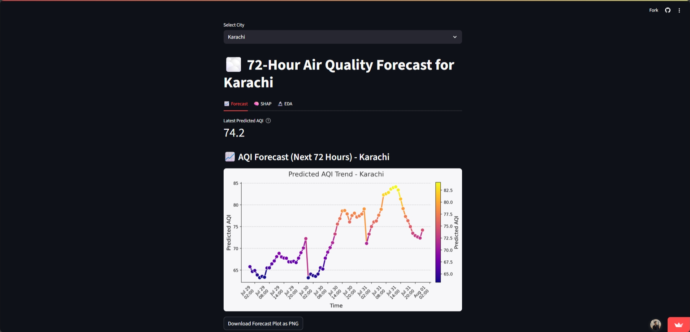

# 🌫️ AQI Multi-City Forecasting & Analysis Dashboard

An interactive and automated platform for **72-hour Air Quality Index (AQI) forecasting**, **model explainability**, and **exploratory data analysis (EDA)** for major cities in Pakistan — **Karachi, Islamabad, and Lahore**. The system is powered by CI/CD workflows, machine learning models, and a visually intuitive **Streamlit UI**.

---

## 🚀 Features

* 🔄 **Multi-City Forecasting:** Real-time AQI prediction for Karachi, Islamabad, and Lahore.
* ⚙️ **Automated Data Pipeline:**

  * Hourly/daily data fetched via **Open-Meteo APIs**.
  * Automatic deduplication and time-based merge for air quality and weather features.
  * Integrated with **GitHub Actions** for continuous updates.
* 📈 **Modeling:**

  * Trained multiple ML models: **Ridge Regression**, **Random Forest**, **Gradient Boosting**, and **XGBoost**.
  * Auto-saves predictions and inputs for transparency and future analysis.
* 🧠 **Model Explainability:**

  * SHAP visualizations for feature impact per city.
  * Downloadable summary plots.
* 💻 **Interactive Streamlit Dashboard:**

  * Tabbed interface: **Forecast**, **SHAP**, and **EDA**.
  * Modern visualizations with **Plotly**, **Seaborn**, and **Matplotlib**.
  * Enhanced AQI table with emoji-based air quality bands.
  * Download buttons for all visual content.
* 📊 **Exploratory Data Analysis (EDA):**

  * Correlation heatmaps, histograms, time-series trends.
  * User-selectable feature views.

---

## 🗂️ Project Structure

```
.
├── new_app.py                            # Streamlit app UI
├── fetch_historical_data_new.py          # Fetch and merge historical AQ + weather data
├── backfill_new.py                       # 24-hour backfill into historical CSV
├── forecast_aqi_new.py                   # 72-hour forecast + SHAP summary export
├── model_testing_new.py                  # Train/evaluate models per city; saves models
├── requirements.txt                      # Python dependencies
├── data/
│   ├── historical_combined_cities_new.csv    # Historical features
│   ├── predictions_Karachi.csv               # Latest predictions (per city)
│   ├── predictions_Islamabad.csv
│   ├── predictions_Lahore.csv
│   ├── shap_karachi.png                      # SHAP summary (per city)
│   ├── shap_islamabad.png
│   ├── shap_lahore.png
│   └── test_results.csv                      # Model comparison results
└── model/
    ├── Ridge_<City>.joblib
    ├── RandomForest_<City>.joblib
    ├── GradientBoosting_<City>.joblib
    ├── XGBoost_<City>.joblib
    └── scaler_<City>.joblib                  # For Ridge
```

---

## ⚡ Quickstart

### 1. Clone the Repo

```bash
git clone https://github.com/Quddusi-K/AQI_Prediction.git
cd AQI_Prediction
```

### 2. Install Dependencies

```bash
pip install -r requirements.txt
```

### 3. Prepare Data and Forecasts

```bash
# (a) Fetch/refresh historical features (if the historical_combined_cities_new.csv doesn't exist already else don't run)
python fetch_historical_data_new.py

# (b) Optionally backfill last 24h into historical file
python backfill_new.py

# (c) Generate 72-hour forecasts and SHAP plots
python forecast_aqi_new.py
```

### 4. Launch the Streamlit App

```bash
streamlit run new_app.py
```

---

## 🖥️ Dashboard Usage

### 🏙️ City Selection

Use the dropdown to toggle between cities (Karachi, Islamabad, Lahore).

### 📂 Tabs Overview

* **Forecast:**

  * 72-hour AQI line plot (color gradient).
  * Enhanced prediction table with AQI categories.
* **SHAP:**

  * Model interpretability using SHAP summary plot.
* **EDA:**

  * View correlations, feature distributions, and time-based feature trends.

---

## 🔗 Data Source APIs

* 🌫️ [Open-Meteo Air Quality API](https://open-meteo.com/)
* 🌦️ [Open-Meteo Weather API](https://open-meteo.com/)

---

## 🧪 Core Dependencies

| Package              | Purpose                         |
| -------------------- | ------------------------------- |
| `streamlit`          | UI framework                    |
| `scikit-learn`       | ML training & prediction        |
| `xgboost`            | Gradient boosting model         |
| `shap`               | Model explainability            |
| `matplotlib`         | Static visualizations           |
| `plotly`             | Interactive charts              |
| `seaborn`            | EDA visualizations              |
| `openmeteo_requests` | Open-Meteo API client           |
| `requests_cache`     | HTTP response caching           |
| `retry_requests`     | Retry adapter for requests      |
| `joblib`             | Model saving/loading            |
| `requests`           | API access                      |
| `kaleido`            | Exporting Plotly to PNG         |

---

## 🔁 CI/CD Workflows (GitHub Actions)

You can automate data updates, forecasts, and optional retraining using GitHub Actions. Create the YAML files below under `.github/workflows/` in your repository.

### 1) Hourly Backfill + Forecast
Runs hourly to append the last 24h into `data/historical_combined_cities_new.csv` and regenerate city forecasts and SHAP plots.

### 2) Daily Forecast Refresh
Runs once per day to recompute the next 72h forecasts even if historical data didn’t change.


### 3) Optional: Weekly Model Retraining/Testing

Runs weekly to evaluate and (re)save models for each city using `model_testing_new.py`.


## 📸 Screenshots



---

## 🤝 Contributing

Contributions and feedback are welcome!

* Open an [issue](https://github.com/Quddusi-K/AQI_Prediction/issues)
* Or submit a pull request for improvements.

---

## 📬 Contact

Built with ❤️ by [M. Quddusi Kashaf](https://github.com/Quddusi-K).

For questions, please create a GitHub issue or contact via repository discussions.

